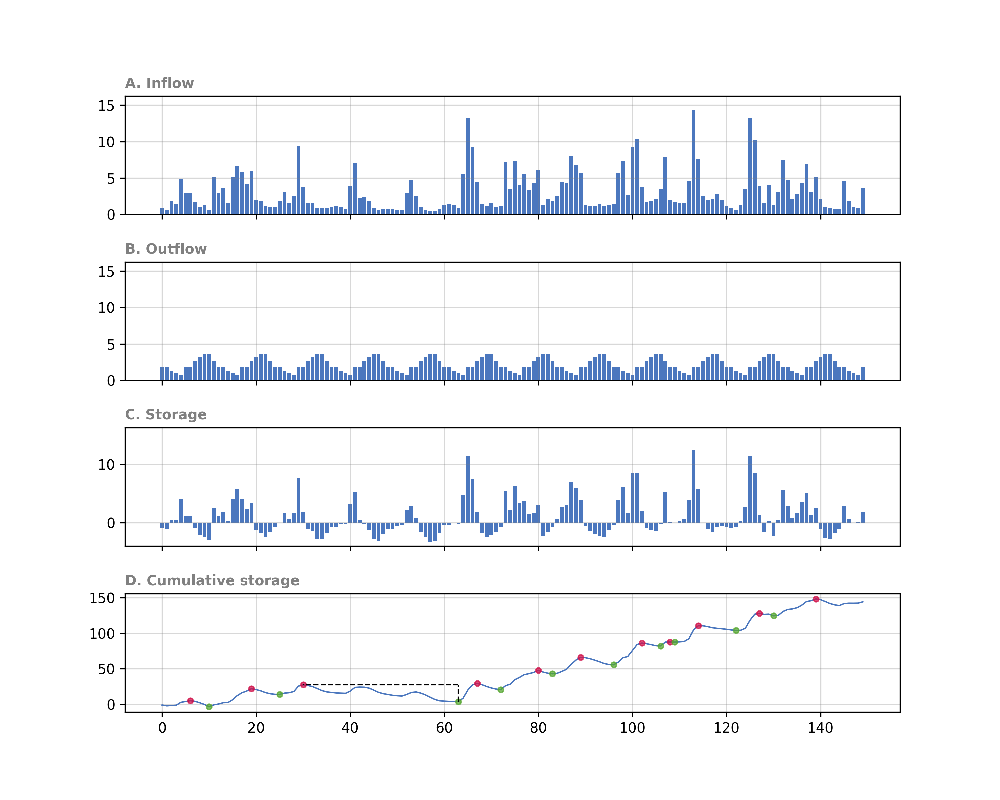
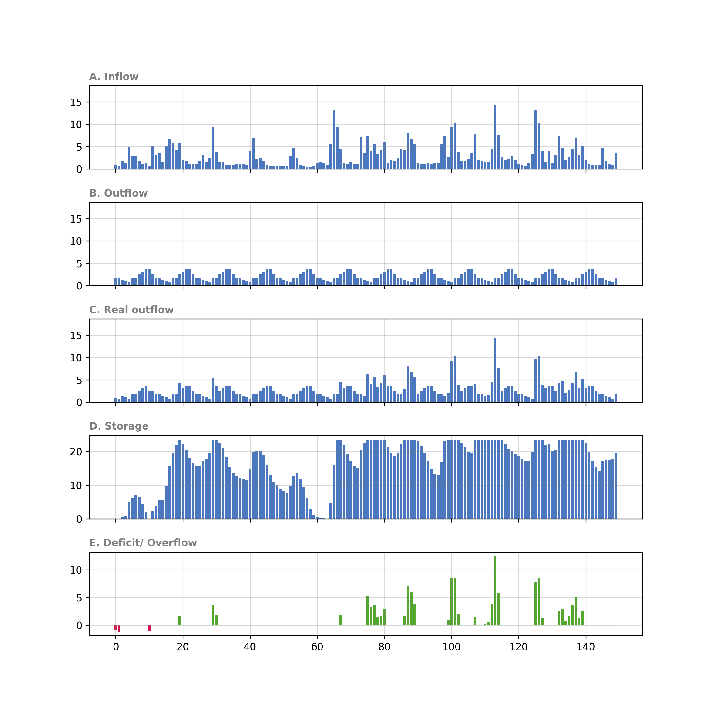

[](https://)

# sequent-peak-algorithm

Python implementation of the Sequent Peak Algorithm for the design and simulation of water reservoirs in hydrology.

# Installation with requirements

```
pip install numpy==1.26.2
pip install matplotlib==3.8.2
pip install sequent-peak-algorithm==0.0.2
```

# Usage example

```python 
import pandas as pd
import matplotlib.pyplot as plt
import sequent_peak_algorithm.sequent_peak_algorithm as spa


# 1. Read raw data and extract data to lists
df = pd.read_csv('examples/example_1_raw_data.csv')
df = df.iloc[:150]
months = df["month"].tolist()
q_in = df["Q_in_hm3"].tolist()
q_out = df["Q_out_hm3"].tolist()

# 2. Run sequent peak algorithm
res_cap = spa.spa(q_in=q_in, q_out=q_out)

# 3. Plot results from sequent peak algorithm
fig_cap = spa.spa_plot(res_cap)
plt.savefig("examples/example_1_spa.png", dpi=300)

# 4. Simulate reservoir
res_sim = spa.sim(
    q_in=q_in,
    q_out=q_out,
    initial_storage=0.0,
    capacity=res_cap.capacity
)

# 5. Plot results from simulation
fig_sim = spa.sim_plot(res_sim)
plt.savefig("examples/example_1_sim.png", dpi=300)
```
For further explanations see the [examples/example_1.ipynb](examples/example_1.ipynb) folder.

#### Sequent Peak Algorithm Visualization


#### Simulation Visualization


# Documentation

## `spa`
#### Parameters
- `q_in: list[float]` : discharge input values
- `q_out: list[float]`: discharge output values

#### Returns
- `Result: collections.namedtuple`: Result of the sequent peak algorithm with the following attributes:
    - `q_in: list[float]`: discharge input values
    - `q_out: list[float]`: discharge output values
    - `storage: list[float]`: storage values, calculated with `_storage`
    - `cumulative_storage: list[float]`: cumulative storage values, calculated with `_cumulative_storage` 
    - `max_vals: list[float]`: discharge values of the maxima, calculated with `_maxima`
    - `max_indices: list[int]`: indices of the maxima, calculated with `_maxima`
    - `min_vals: list[float]`: discharge values of the minima, calculated with `_minima`
    - `min_indices: list[int]`: indices of the minima, calculated with `_minima`
    - `capacity: list[float]`: capacity, calculated with `_capacity`
    - `capacity_indices: list[int]`: indices of the capacity (multiple positions possible), calculated with `_capacity`
    - `capacity_max_vals: list[float]`: preceeding maxima of the capacity, calculated with `_capacity`
    - `capacity_max_indices: list[int]`: indices of the preceeding maxima of the capacity, calculated with `_capacity`
    - `capacity_min_vals: list[float]`: succeeding minima of the capacity, calculated with `_capacity`
    - `capacity_min_indices: list[int]`: indices of the succeeding minima of the capacity, calculated with `_capacity`

## `sim`
#### Parameters
- `q_in: list[float]` : discharge input values
- `q_out: list[float]`: discharge output values
- `initial_storage: float`: initial storage value, chosen by the user
- `capacity: float`: capacity values, calculated with `spa` or chosen by the user

#### Returns
- `Result: collections.namedtuple`: Result of the sequent peak algorithm with the following attributes:
    - `q_in: list[float]` : discharge input values
    - `q_out: list[float]`: discharge output values
    - `initial_storage: float`: initial storage value, chosen by the user
    - `capacity: list[float]`: capacity values, calculated with `spa` or chosen by the user
    - `q_out_real: list[float]`: real discharge output accounting for the capacity (deficit and overflow situations)
    - `storage: list[float]`: storage values
    - `deficit: list[float]`: deficit values
    - `overflow: list[float]`: overflow values

## `spa_plot`
#### Parameters
- `Result: collections.namedtuple`: Result of the sequent peak algorithm
#### Returns
- `fig: matplotlib.figure.Figure`: Figure object of the plot

## `sim_plot`
#### Parameters
- `Result: collections.namedtuple`: Result of the storage simulation
#### Returns
- `fig: matplotlib.figure.Figure`: Figure object of the plot